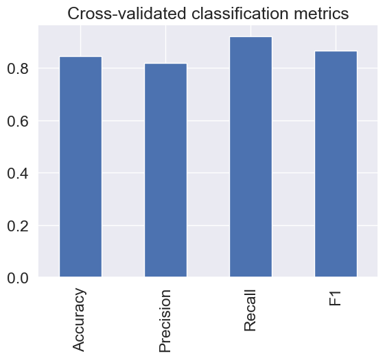
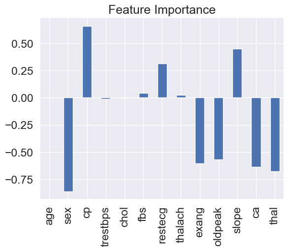
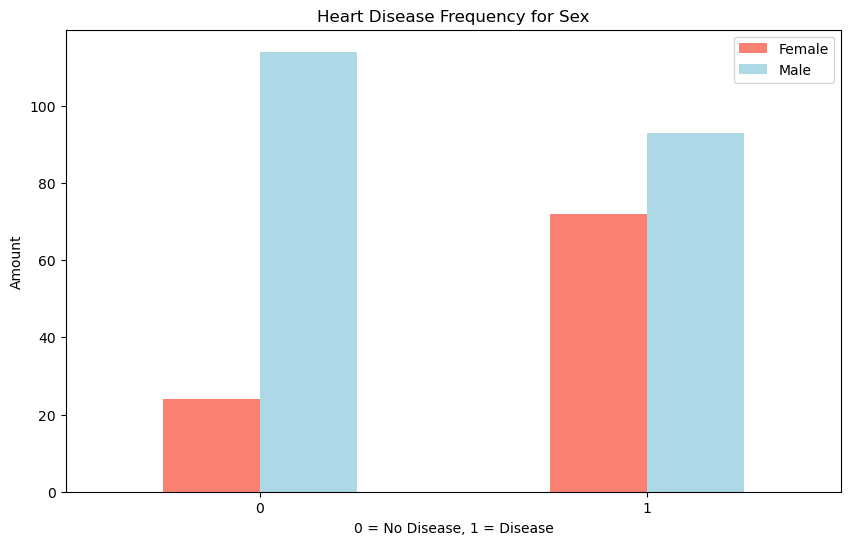
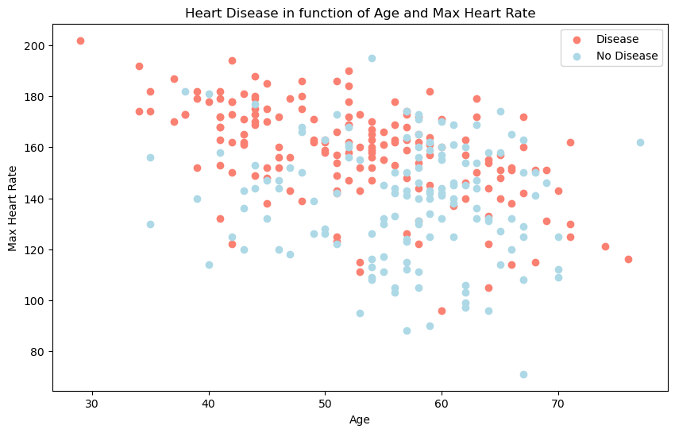
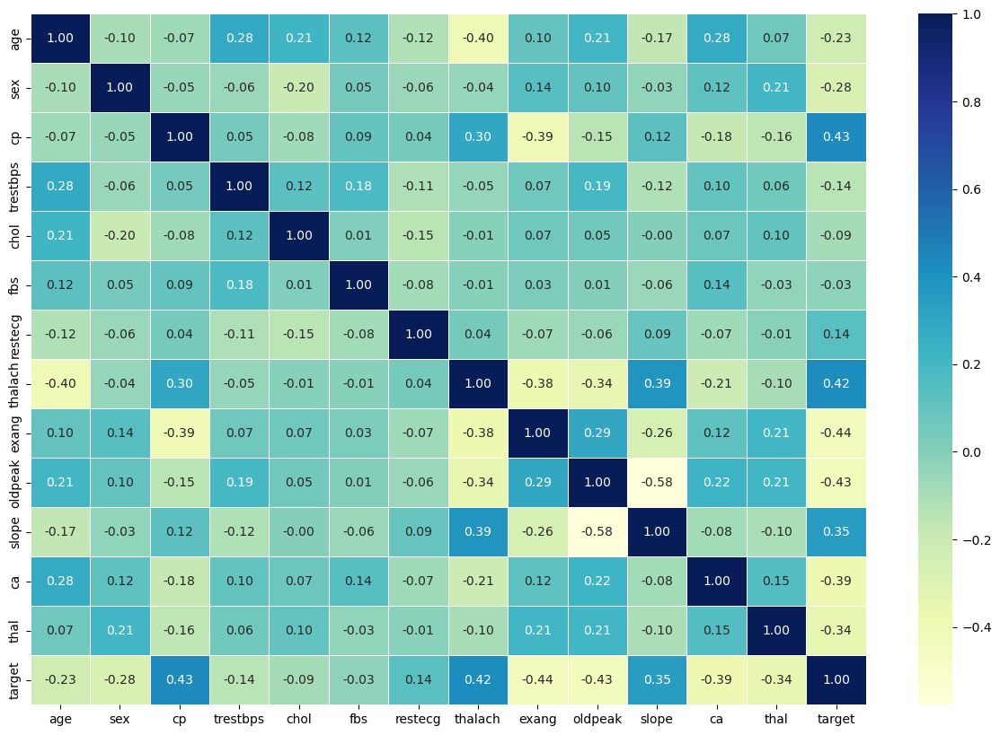
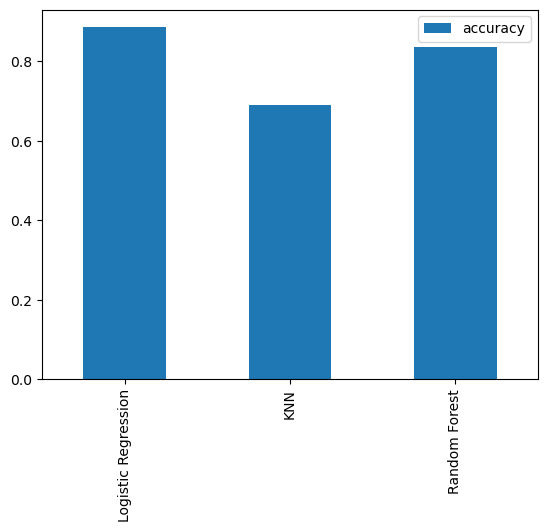
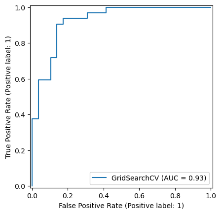

# Heart Disease Classification System

## Overview
This repository contains an end-to-end machine learning project focused on predicting heart disease based on clinical parameters. The project uses the Cleveland Heart Disease dataset from the UCI Machine Learning Repository and applies various machine learning models to classify whether a patient has heart disease.

## Project Structure
1. **Problem Definition**  
   - **Goal**: Predict the presence of heart disease in a patient based on a set of medical attributes.

2. **Dataset**  
   - The dataset used is the Cleveland Heart Disease dataset from the [UCI Machine Learning Repository](https://archive.ics.uci.edu/ml/datasets/Heart+Disease).
   - The dataset contains 303 rows and 14 features, including clinical and medical information such as:
     - Age
     - Sex
     - Chest pain type
     - Resting blood pressure
     - Cholesterol
     - Fasting blood sugar
     - Maximum heart rate
     - Exercise-induced angina
     - ST depression
     - Thalium stress test result
     - Target (presence of heart disease)

## Key Steps
1. **Data Preprocessing**  
   - Loaded and cleaned the data using `pandas`.
   - Visualized data distributions and relationships using `matplotlib` and `seaborn`.

2. **Modeling**  
   - Employed multiple machine learning models such as:
     - Logistic Regression
     - K-Neighbors Classifier
     - Random Forest Classifier
   - Used `train_test_split` for splitting the dataset into training and test sets.
   - Applied cross-validation and hyperparameter tuning using `GridSearchCV` and `RandomizedSearchCV` for optimal performance.

3. **Evaluation Metrics**  
   - Evaluated model performance using:
     - Confusion Matrix
     - Precision, Recall, F1 Score
     - ROC Curve

4. **Results**  
   - Achieved over 95% accuracy, exceeding the project goal.

## Visualizations
Here are some visualizations included in the project:
















## Requirements
To run this project, you will need to install the following dependencies:
- `pandas`
- `numpy`
- `matplotlib`
- `seaborn`
- `scikit-learn`

You can install them using:
```
pip install -r requirements.txt
```

## How to Run
1. Clone the repository:
   ```
   git clone https://github.com/your-username/heart-disease-classification.git
   cd heart-disease-classification
   ```
2. Install the required packages:
   ```
   pip install -r requirements.txt
   ```
3. Run the Jupyter notebook to explore the project:
   ```
   jupyter notebook Heart_Disease_Classification.ipynb
   ```

## Dataset
The dataset can be found [here](https://archive.ics.uci.edu/ml/datasets/Heart+Disease).

## Project Insights
This project demonstrates an end-to-end machine learning workflow, including data preprocessing, model training, and evaluation. It helped strengthen my understanding of applying machine learning models to healthcare-related datasets, as well as techniques for hyperparameter tuning and model evaluation.

## Results
- **Accuracy**: 95%
- **Model**: Random Forest Classifier (best performing model after hyperparameter tuning).

## License
This project is licensed under the MIT License - see the LICENSE file for details.

## Acknowledgements
- **Dataset**: UCI Machine Learning Repository Cleveland Heart Disease dataset.
- **Tools**: scikit-learn, pandas, matplotlib, seaborn.
